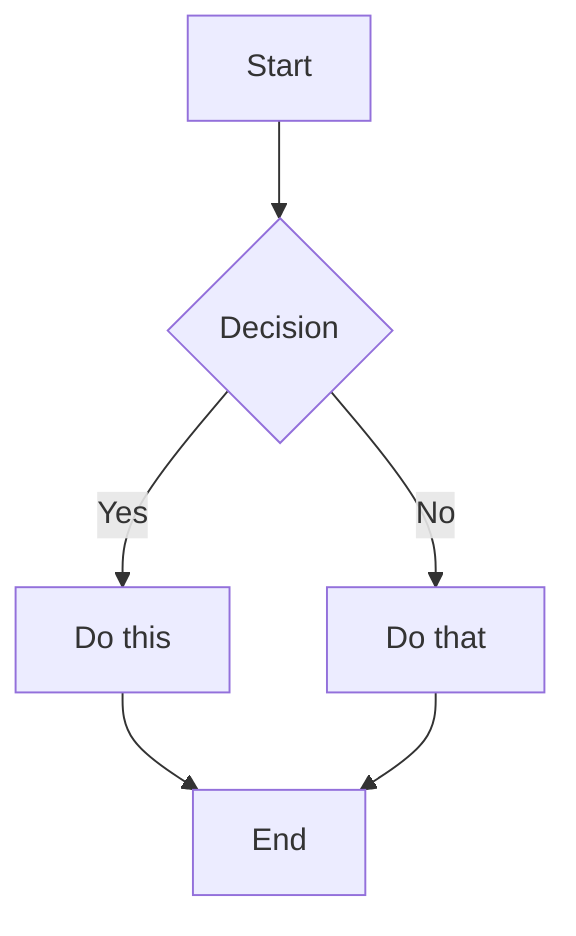
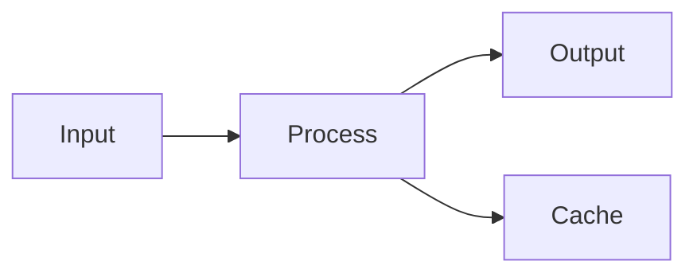

# Orca Note Flavored Markdown Skill

This skill enables skills-compatible agents to create and edit valid Orca Note Flavored Markdown, including all Orca Note-specific syntax extensions.

## Overview

Orca Note uses a combination of Markdown flavors:
- [CommonMark](https://commonmark.org/)
- [GitHub Flavored Markdown](https://github.github.com/gfm/)
- [LaTeX](https://www.latex-project.org/) for math
- Orca Note-specific extensions (auto headings, highlights, callouts, etc.)

## Basic Formatting

### Paragraphs and Line Breaks

```markdown
This is a paragraph.

This is another paragraph (blank line between creates separate paragraphs).
```

### Headings

```markdown
# Heading 1
## Heading 2
### Heading 3
#### Heading 4
```

Maximum heading level is 4 (`####`).

### Text Formatting

| Style | Syntax | Example | Output |
|-------|--------|---------|--------|
| Bold | `**text**` or `__text__` | `**Bold**` | **Bold** |
| Italic | `*text*` or `_text_` | `*Italic*` | *Italic* |
| Bold + Italic | `***text***` | `***Both***` | ***Both*** |
| Strikethrough | `~~text~~` | `~~Striked~~` | ~~Striked~~ |
| Highlight | `==text==` | `==Highlighted==` | ==Highlighted== |
| Inline code | `` `code` `` | `` `code` `` | `code` |

### Escaping Formatting

Use backslash to escape special characters:
```markdown
\*This won't be italic\*
\#This won't be a heading
1\. This won't be a list item
```

Common characters to escape: `\*`, `\_`, `\#`, `` \` ``, `\|`, `\~`

## Markdown-Style Links

```markdown
[Display Text](https://example.com)
[Link used outside of Orca Note](orca-note://[repo]/block?blockId=[blockId])
```

Note: Spaces must be URL-encoded as `%20` in Markdown links.

## Images, Videos & Audios

```markdown


```

## Callouts

### Basic Callout

```markdown
> [!note]
> This is a note callout.
```

### Nested Callouts

```markdown
> [!info]
> Outer callout
> > [!note]
> > Inner callout
```

### Supported Callout Types

| Type | Description |
|------|-------------|
| `info` | Blue, info icon |
| `warning` | Orange, warning icon |
| `error` | Red, exclamation icon |
| `tip` | Green, bulb icon |
| `important` | Purple, exclamation icon |
| `note` | Grey, note icon |

## Lists

### Unordered Lists

```markdown
- Item 1
- Item 2
  - Nested item
  - Another nested
- Item 3
```

### Ordered Lists

```markdown
1. First item
2. Second item
   1. Nested numbered
   2. Another nested
3. Third item
```

### Task Lists

```markdown
- [ ] Incomplete task
- [x] Completed task
- [ ] Task with sub-tasks
  - [ ] Subtask 1
  - [x] Subtask 2
```

## Quotes

```markdown
> This is a blockquote.
> It can span multiple lines.
>
> And include multiple paragraphs.
>
> > Nested quotes work too.
```

## Code

### Inline Code

```markdown
Use `backticks` for inline code.
Use double backticks for ``code with a ` backtick inside``.
```

### Code Blocks

````markdown
```
Plain code block
```

```javascript
// Syntax highlighted code block
function hello() {
  console.log("Hello, world!");
}
```

```python
# Python example
def greet(name):
    print(f"Hello, {name}!")
```
````

## Tables

```markdown
| Header 1 | Header 2 | Header 3 |
|----------|----------|----------|
| Cell 1   | Cell 2   | Cell 3   |
| Cell 4   | Cell 5   | Cell 6   |
```

## Math (LaTeX)

### Inline Math

```markdown
This is inline math: $e^{i\pi} + 1 = 0$
```

### Block Math

```markdown
$$
\begin{vmatrix}
a & b \\
c & d
\end{vmatrix} = ad - bc
$$
```

### Common Math Syntax

```markdown
$x^2$              Superscript
$x_i$              Subscript
$\frac{a}{b}$      Fraction
$\sqrt{x}$         Square root
$\sum_{i=1}^{n}$   Summation
$\int_a^b$         Integral
$\alpha, \beta$    Greek letters
```

## Diagrams (Mermaid)

````markdown

````

## Whiteboard (Excalidraw)

````markdown
```whiteboard
{
  "elements": [...],
  "files": {}
}
```
````

## Horizontal Rules

```markdown
---
***
___
- - -
* * *
```

## Complete Example

````markdown
# Project Alpha

## Overview

This project aims to improve workflow using modern techniques.

> [!important]
> The first milestone is due on ==January 30th==.

## Tasks

- [x] Initial planning
- [x] Resource allocation
- [ ] Development phase
  - [ ] Backend implementation
  - [ ] Frontend design
- [ ] Testing
- [ ] Deployment

## Technical Notes

The main algorithm uses the formula $O(n \log n)$ for sorting.

```python
def process_data(items):
    return sorted(items, key=lambda x: x.priority)
```

## Architecture


````

## References

- See `mermaid-diagrams` skill for Mermaid syntax and more details.
- See `excalidraw-whiteboard` skill for Excalidraw whiteboard syntax and more details.
